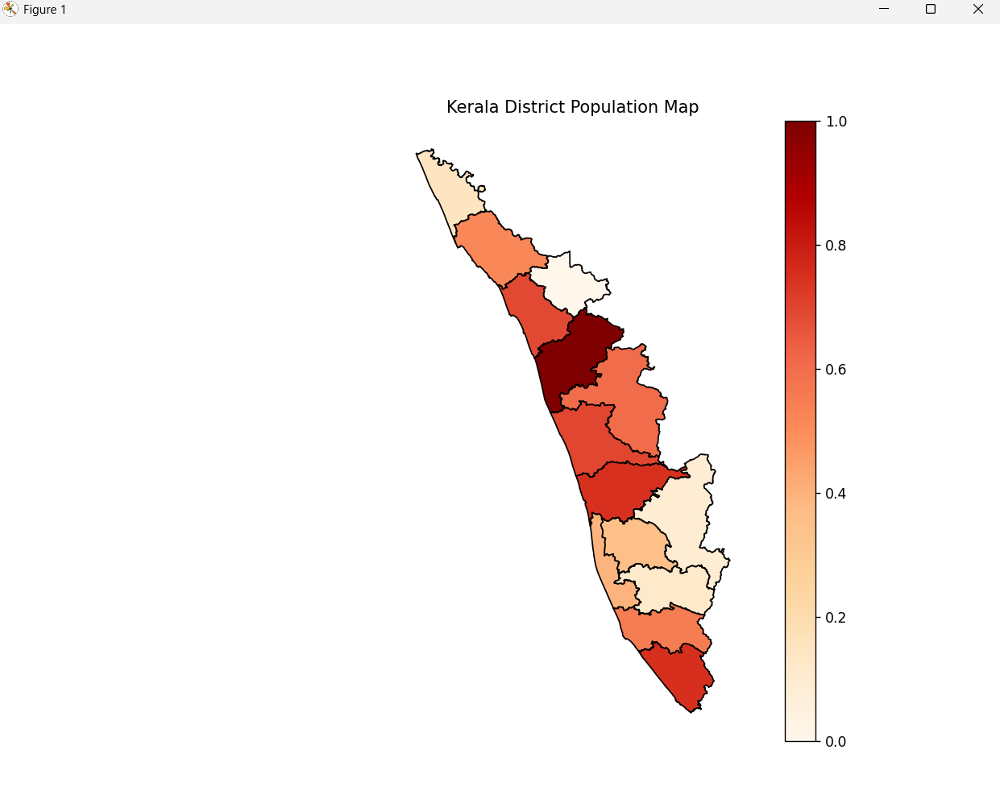
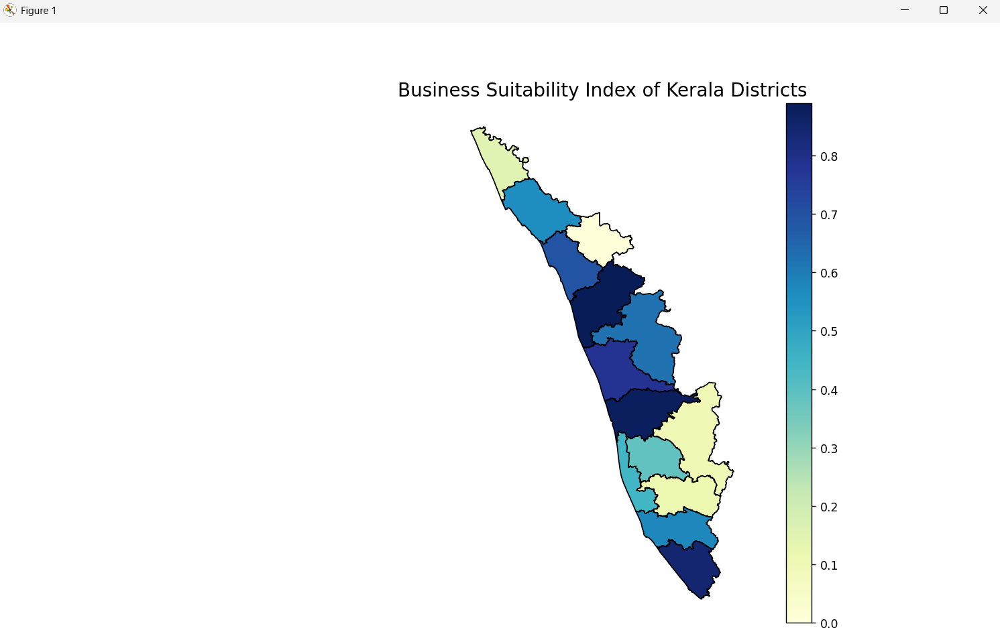
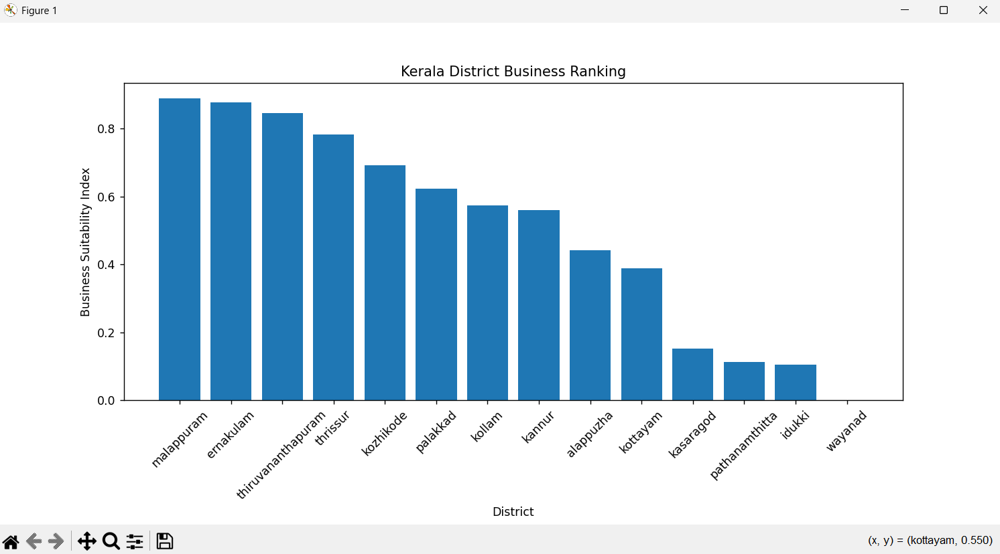
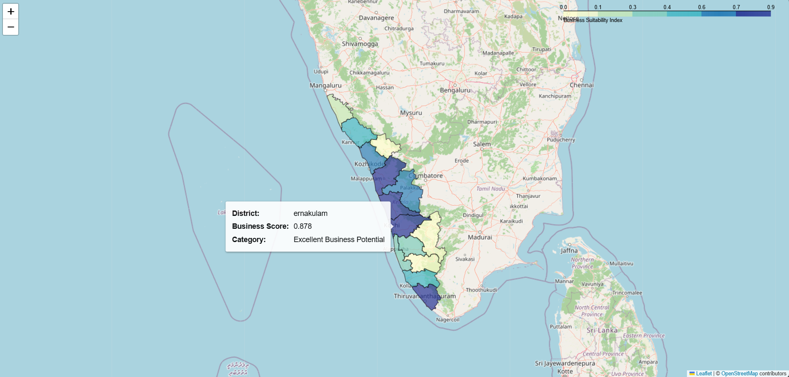
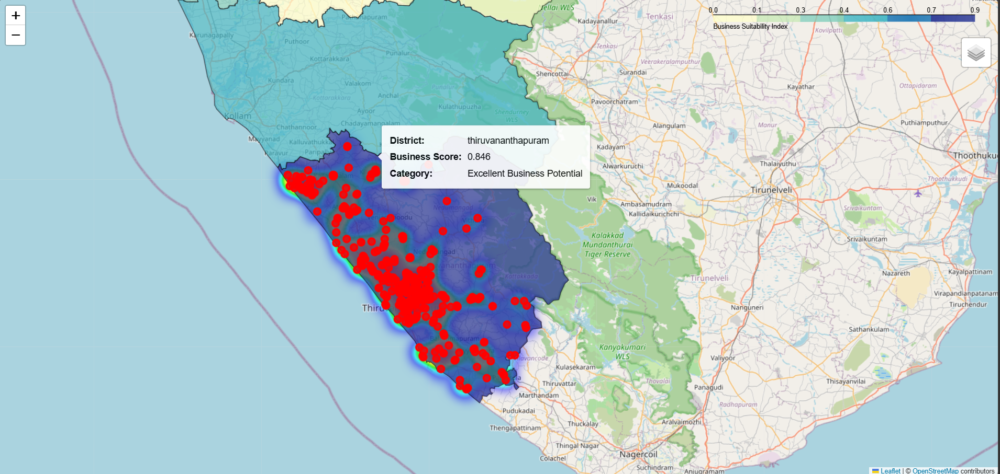

# Location Intelligence for Retail Expansion: A GeoPandas Study on Kerala

Built a geospatial data pipeline to compute a weighted Business Suitability 
Index (BSI) across all 14 Kerala districts by merging the 2011 Census of India 
with district boundary GeoJSON using GeoPandas. Applied Min-Max normalization 
via scikit-learn to standardize demographic indicators — population, literacy 
rate, workforce size, and purchasing power parity — then combined them using 
domain-weighted scoring to rank districts by retail viability. Visualized results 
through static choropleth maps (Matplotlib) and an interactive Folium map with 
district-level tooltips. Integrated a live competitor density layer via the 
Overpass API (OpenStreetMap) with a heatmap overlay.

## Output

## Stack
Python · GeoPandas · Pandas · Matplotlib · Folium · scikit-learn · Overpass API

## Setup
pip install -r requirements.txt
python prog.py

## Data Source
- Census of India 2011 — Government of India open data
- Kerala District Boundary GeoJSON — OpenStreetMap contributors
